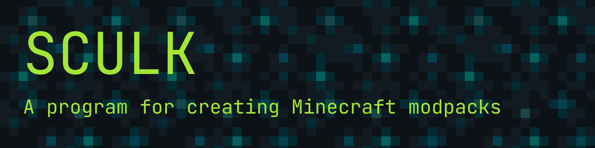

[Read the Docs](https://sculk-cli.github.io) • [Report Issues](https://github.com/sculk-cli/sculk) • [Chat on Discord](https://discord.jamalam.tech) 

> **Warning**
> This project is in early development.

Sculk is a CLI tool for creating Minecraft modpacks, much like Packwiz. It is **aimed at modpack creators**, rather than users (for users, a program such as [Ferium](https://github.com/gorilla-devs/ferium) is recommended)

## Why Sculk?

- **Multi-source support**: Sculk allows one mod to have multiple sources (e.g. Curseforge, Modrinth, and a URL). This means that you can export Modrinth and Curseforge modpacks from the same Sculk modpack.
- **Content support**: Sculk supports mods, datapacks, resource packs, and shader packs - as well as any other files you want to include in your modpack (e.g. configs).
- **Ease of use**: Sculk is designed to be easy to use, with a simple command-line interface (with nice prompts!).
- **Import support**: Sculk allows you to convert an existing Modrinth, Curseforge, or Packwiz modpack into a Sculk modpack.
- **Dependency management**: Sculk automatically installs dependencies for you, and will keep track of them so that they can be removed if their dependant is.
- _[Planned]_ **Rollback system**: Sculk keeps track of changes made to the modpack, so that you can easily revert changes - because it's too easy to forget to keep your Git commits granular.
- _[Planned]_ **Publishing support**: Sculk can export to Curseforge and Modrinth modpacks, and can even publish them for you from the command line.

## Links

- [Documentation](https://sculk-cli.github.io)
- [Example modpack](https://github.com/sculk-cli/example)
